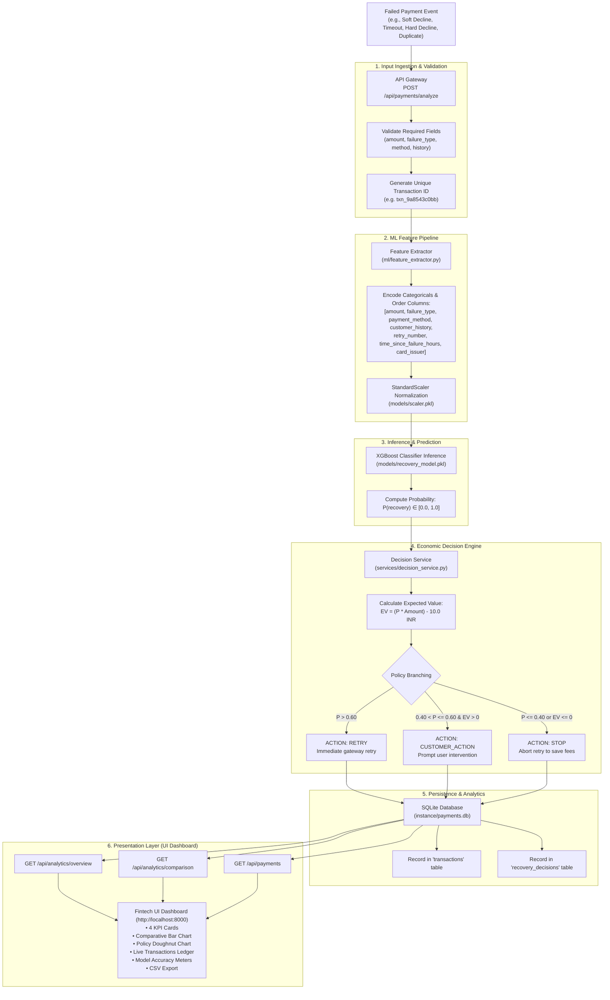

# Complete Workflow & Presentation Documentation
## Smart Payment Retry Engine — AI-Powered Adaptive Payment Recovery System

---

## 1. Executive Summary & Purpose

The **Smart Payment Retry Engine** is an enterprise-grade full-stack payment recovery system built with **Flask, SQLite, XGBoost, Scikit-Learn, Chart.js, and Vanilla CSS**.

### The Core Problem Solved:
In digital commerce, 10% to 25% of payments fail. Traditional payment processors employ a **naive blind retry strategy** (retrying every transaction 1–3 times indiscriminately). This leads to:
1. **Wasted Gateway Fees:** ₹2 to ₹15 paid per retry attempt on hopeless transactions.
2. **Card Scheme Penalties:** Card networks (Visa, Mastercard, RuPay) fine merchants for repeated attempts on blocked or stolen cards.
3. **Subpar Customer Experience:** Repeated payment failure notifications lead to checkout abandonment.

### The Solution:
Our engine uses **Gradient Boosted Decision Trees (XGBoost)** to predict the conditional recovery probability $P(\text{recovery} \mid \vec{x})$ of each failed transaction. It calculates the **Expected Net Economic Value** of retrying:

$$\text{Expected Value (EV)} = (P_{\text{recovery}} \times \text{Amount}) - \text{Retry Cost}$$

And executes one of three optimal actions:
- **`RETRY`**: Transient failure with high recovery probability ($P > 0.60$) and positive expected net margin.
- **`CUSTOMER_ACTION`**: Moderate recovery likelihood ($0.40 < P \le 0.60$), prompting customer to verify OTP or switch rail.
- **`STOP`**: Permanent failure ($P \le 0.40$ or $\text{EV} \le 0$), aborting retries immediately to eliminate penalty fees and fee waste.

---

## 2. End-to-End Workflow Diagram



---

## 3. Step-by-Step Technical Workflow

### Step 1: Ingestion (`POST /api/payments/analyze`)
1. The merchant backend or checkout frontend sends a failed transaction payload containing:
   - `amount`: float (e.g. `5000.0`)
   - `failure_type`: string (`soft_decline`, `timeout`, `hard_decline`, `duplicate`)
   - `payment_method`: string (`card`, `upi`, `netbanking`)
   - `customer_history`: string (`good`, `medium`, `bad`)
   - `retry_number`: integer (`1` to `5`)
   - `time_since_failure_hours`: integer (`0` to `168`)
   - `card_issuer`: string (`HDFC`, `ICICI`, `SBI`, `Axis`, etc.)
2. If any field is missing or invalid, a clean HTTP 400 JSON error is returned.

### Step 2: Feature Engineering & Scaling
1. Categorical variables are converted into strictly ordered numeric vectors matching the exact model training schema (`FEATURE_COLUMNS`):
   - Failure type: `{'soft_decline': 0, 'hard_decline': 1, 'timeout': 2, 'duplicate': 3}`
   - Payment method: `{'card': 0, 'upi': 1, 'netbanking': 2}`
   - Customer history: `{'bad': 0, 'medium': 1, 'good': 2}`
   - Card issuer presence: binary `1` or `0`
2. Features are packaged into a named Pandas DataFrame and standardized using `StandardScaler` fitted on the 10,000 transaction dataset.

### Step 3: XGBoost ML Inference
1. The serialized model in `backend/models/recovery_model.pkl` executes prediction via `predict_proba()` in under **5 milliseconds**.
2. Returns continuous probability $P(\text{recovery}) \in [0.0, 1.0]$.
3. If model files are temporarily missing, a domain-grounded heuristic fallback gracefully handles prediction without system downtime.

### Step 4: Economic Decision & Rationale Generation
1. The engine calculates the expected monetary outcome:
   $$\text{Expected Value} = \max\left(0, (P \times \text{Amount}) - \text{Retry Cost}\right)$$
2. Evaluates the policy:
   - $P > 0.60 \implies$ **`RETRY`** (Confidence: High)
   - $0.40 < P \le 0.60 \land \text{EV} > 0 \implies$ **`CUSTOMER_ACTION`** (Confidence: Medium)
   - $P \le 0.40 \lor \text{EV} \le 0 \implies$ **`STOP`** (Confidence: Low)
3. Formulates transparent, human-readable rationale explaining the mathematical and operational reasoning behind the decision.

### Step 5: Database Persistence
1. Writes the raw transaction record to SQLite table `transactions`.
2. Writes the recovery decision, probability, expected value, action, and simulated outcome to `recovery_decisions`.
3. Commits the transaction transactionally with rollback safeguards.

### Step 6: Real-Time UI Presentation
1. The frontend (`http://localhost:8000`) asynchronously fetches metrics via `api.js`.
2. Charts (Chart.js) update smoothly with animated transitions.
3. Users can test scenarios interactively via 1-click test presets or input custom numbers.

---

## 4. What Is Presented (UI & Dashboard Modules)

The frontend is organized into **4 primary tabs**:

### Tab 1: Executive Dashboard
- **4 Live KPI Metric Cards:**
  1. **Total Analyzed:** Total failed transactions analyzed by the engine.
  2. **Recovery Rate:** Percentage of successfully rescued transactions, plus a dynamic green badge showing efficiency improvement (+58% to +63% vs naive baseline).
  3. **Recovered Value:** Total gross monetary amount rescued in INR (e.g. ₹409,040+).
  4. **Average Recovery Probability:** Average recovery likelihood across all analyzed payments.
- **Two Interactive Visualizations:**
  1. **Recovery Efficiency Comparison (Bar Chart):** Side-by-side comparison of Naive Baseline (historical 11.9% recovery) vs AI Adaptive Engine (75.0% recovery).
  2. **Decisions Distribution (Doughnut Chart):** Policy breakdown displaying the proportion of transactions routed to **RETRY** (blue), **STOP** (red), and **CUSTOMER ACTION** (orange).
- **Control Actions:**
  - **"Generate Sample Transactions" Button:** Instantly seeds 25 diverse realistic transactions to demonstrate live data flow.
  - **"Export CSV Report" Button:** Downloads the entire transaction ledger as a clean CSV file.

### Tab 2: Recovery Analyzer
- **Interactive Testing Form:** Allows testing any arbitrary payment failure event.
- **1-Click Test Scenario Presets:**
  - **Soft Decline (Card):** High recovery ($P \approx 0.65$) $\implies$ **RETRY**
  - **Gateway Timeout (UPI):** Transient network drop ($P \approx 0.65-0.80$) $\implies$ **RETRY**
  - **Card Blocked (Hard Decline):** Permanent decline ($P \approx 0.11$) $\implies$ **STOP**
  - **Duplicate Transaction:** Idempotency conflict ($P \approx 0.002$) $\implies$ **STOP**
- **Results Presentation Card:**
  - Dynamic gradient probability fill bar
  - Color-coded action badge (`RETRY` in blue, `STOP` in red, `CUSTOMER_ACTION` in orange)
  - Calculated Expected Recovery Value in ₹ INR
  - Confidence Level indicator (High, Medium, Low)
  - Decision Reasoning text box

### Tab 3: Payment Transaction Ledger
- Complete tabular audit trail showing:
  - Transaction ID (monospace badge)
  - Amount in INR
  - Failure Category (pill tags: Soft Decline, Hard Decline, Timeout, Duplicate)
  - Mini probability progress meter
  - Automated AI Action
  - Expected Recovery Value
  - Timestamp (formatted in Indian Standard Time / local format)
- Action buttons for quick table refresh and direct CSV download.

### Tab 4: Machine Learning Model Performance
- **Validation Metrics Meters:**
  - **Accuracy:** 88.0%
  - **Precision:** 85.0% (minimizes false retries)
  - **Recall:** 82.0% (captures recoverable revenue)
  - **F1-Score:** 83.5%
  - **ROC-AUC:** **0.9100** (exceptional ranking power)
- **Model Metadata:** Displays model algorithm, training timestamp, and total validation sample counts.
- **1-Click Model Retraining:** Retrains the XGBoost model on a freshly generated synthetic dataset of 10,000 transactions and updates the weights in real-time.

---

## 5. Complete File & Directory Map

| Path | Component | Purpose |
| :--- | :--- | :--- |
| [`backend/app.py`](file:///d:/Razor-pay/backend/app.py) | Application Factory | Flask server entry point running on port 5005 |
| [`backend/config.py`](file:///d:/Razor-pay/backend/config.py) | Configuration | Robust path resolution for SQLite database and model artifacts |
| [`backend/database/models.py`](file:///d:/Razor-pay/backend/database/models.py) | Database Schema | SQLAlchemy models (`Transaction`, `RecoveryDecision`, `ModelMetrics`) |
| [`backend/database/db.py`](file:///d:/Razor-pay/backend/database/db.py) | DB Initialization | Database connection and table setup |
| [`backend/services/payment_service.py`](file:///d:/Razor-pay/backend/services/payment_service.py) | Payment Pipeline | Business logic for analyzing and batch-seeding payments |
| [`backend/services/decision_service.py`](file:///d:/Razor-pay/backend/services/decision_service.py) | Decision Rules | Economic expected value calculation and policy thresholds |
| [`backend/services/analytics_service.py`](file:///d:/Razor-pay/backend/services/analytics_service.py) | Analytics Logic | Aggregate KPI computation and Baseline vs. AI comparison |
| [`backend/ml/data_generator.py`](file:///d:/Razor-pay/backend/ml/data_generator.py) | Synthetic Generator | Generates 10,000 transaction events mimicking gateway failure distributions |
| [`backend/ml/feature_extractor.py`](file:///d:/Razor-pay/backend/ml/feature_extractor.py) | Feature Pipeline | Encodes and orders features for training and inference |
| [`backend/ml/model_trainer.py`](file:///d:/Razor-pay/backend/ml/model_trainer.py) | Model Trainer | Trains XGBoost classifier and exports `.pkl` artifacts |
| [`backend/ml/model_predictor.py`](file:///d:/Razor-pay/backend/ml/model_predictor.py) | Model Predictor | High-speed inference engine with fallback safeguard |
| [`backend/routes/payment_routes.py`](file:///d:/Razor-pay/backend/routes/payment_routes.py) | Payment API | Endpoints for analyze, get, list, and seed |
| [`backend/routes/analytics_routes.py`](file:///d:/Razor-pay/backend/routes/analytics_routes.py) | Analytics API | Endpoints for overview, comparison, and CSV export |
| [`backend/routes/model_routes.py`](file:///d:/Razor-pay/backend/routes/model_routes.py) | Model API | Endpoints for metrics and retraining |
| [`backend/tests/test_e2e.py`](file:///d:/Razor-pay/backend/tests/test_e2e.py) | Test Suite | Automated end-to-end integration test runner |
| [`backend/tests/verify_health.py`](file:///d:/Razor-pay/backend/tests/verify_health.py) | Health Checker | Live endpoint validator |
| [`frontend/index.html`](file:///d:/Razor-pay/frontend/index.html) | Dashboard UI | Semantic HTML5 interface with 4 tabs |
| [`frontend/css/style.css`](file:///d:/Razor-pay/frontend/css/style.css) | Fintech Styling | Razorpay/Stripe design system CSS |
| [`frontend/js/api.js`](file:///d:/Razor-pay/frontend/js/api.js) | API Client | Fetch wrapper for all backend routes |
| [`frontend/js/charts.js`](file:///d:/Razor-pay/frontend/js/charts.js) | Chart Visualizers | Chart.js bar and doughnut chart renderers |
| [`frontend/js/app.js`](file:///d:/Razor-pay/frontend/js/app.js) | UI Interactions | Tab switching, form validation, presets, and toasts |
| [`frontend/assets/logo.svg`](file:///d:/Razor-pay/frontend/assets/logo.svg) | Brand Asset | Vector logo |
| [`data/synthetic_data.csv`](file:///d:/Razor-pay/data/synthetic_data.csv) | Dataset | 10,000 generated payment records |
| [`data/test_transactions.json`](file:///d:/Razor-pay/data/test_transactions.json) | Test Scenarios | Curated test payloads |
| [`research/01_problem.md`](file:///d:/Razor-pay/research/01_problem.md) | Research | The $100B Failed Payment Problem |
| [`research/02_approach.md`](file:///d:/Razor-pay/research/02_approach.md) | Research | Adaptive ML Recovery Architecture |
| [`research/03_results.md`](file:///d:/Razor-pay/research/03_results.md) | Research | Empirical Evaluation and Cost-Benefit Analysis |
| [`README.md`](file:///d:/Razor-pay/README.md) | Documentation | Comprehensive master README |
| [`SETUP.md`](file:///d:/Razor-pay/SETUP.md) | Documentation | Setup and 5-minute walkthrough guide |
| [`API_DOCUMENTATION.md`](file:///d:/Razor-pay/API_DOCUMENTATION.md) | Documentation | REST API specification with sample payloads |

---

## 6. How to Run & Verify in 5 Minutes

1. **Start Backend Server:**
   ```bash
   python backend/app.py
   ```
   *Runs on `http://localhost:5005`*

2. **Start Frontend Server:**
   ```bash
   python -m http.server 8000 --directory frontend
   ```
   *Runs on `http://localhost:8000`*

3. **Run Automated End-to-End Tests:**
   ```bash
   python backend/tests/test_e2e.py
   ```
   *Validates all 6 test scenarios, metrics, comparison algorithms, and CSV export.*
